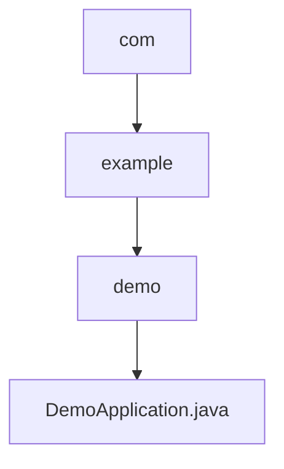

# 基础信息

|      |      |
|------|------|
| 名称 | com |
| 编码语言 | .java |
| 代码路径 | demo/src/main/java/com |
| 包名 | demo.docs.src.main.java.com |
| 概述说明 | SpringBoot应用，含主类和GET接口返回主机名。 |

# 说明

这是一个基于Spring Boot框架的简单Java应用程序示例。它定义了一个主类DemoApplication，使用@SpringBootApplication注解标记为Spring Boot应用入口。类中包含main方法启动应用，并通过@RestController注解表明这是一个REST控制器。控制器中定义了一个GET请求处理方法test()，该方法返回包含主机名的"Hello Word!"字符串。整个应用展示了Spring Boot的基本启动流程和简单的REST接口实现。

### 包内部结构视图

该流程图展示了从com包到DemoApplication.java的层级结构。com包包含example子包，example包下又有demo子包，最终demo包中包含DemoApplication.java文件。这是一个典型的三级Java包结构，展示了从顶级域名到具体应用类的路径关系。

# 文件列表 File List

| 名称   | 类型  | 说明 |
|-------|------|-------------|
| [example](example/_module.md) | package | SpringBoot应用，含主类和GET接口返回主机名。 |

