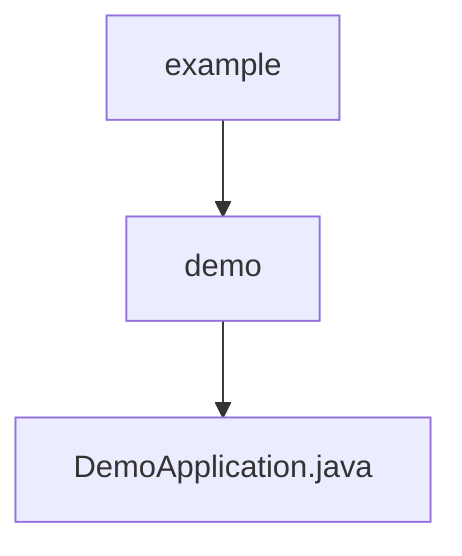

# 基础信息

|      |      |
|------|------|
| 名称 | example |
| 编码语言 | .java |
| 代码路径 | demo/src/main/java/com/example |
| 包名 | demo.docs.src.main.java.com.example |
| 概述说明 | SpringBoot应用，含主类和GET接口返回主机名。 |

# 说明

这是一个基于Spring Boot框架的简单Java应用程序示例。它定义了一个主类DemoApplication，使用@SpringBootApplication注解标记为Spring Boot应用入口。类中包含main方法启动应用，并通过@RestController注解表明这是一个REST控制器。控制器中定义了一个GET请求处理方法test()，该方法返回包含主机名的"Hello Word!"字符串。整个应用展示了Spring Boot的基本启动流程和简单的REST接口实现。

### 包内部结构视图

该流程图展示了Java项目中的三层目录结构：最上层是example包，包含demo子包；demo子包中包含核心启动文件DemoApplication.java。这种层级关系是典型的Spring Boot项目结构，其中启动类位于最内层包路径下，符合Maven/Gradle项目的标准目录规范。

# 文件列表 File List

| 名称   | 类型  | 说明 |
|-------|------|-------------|
| [demo](demo/_module.md) | package | SpringBoot应用，含主类和GET接口返回主机名。 |

