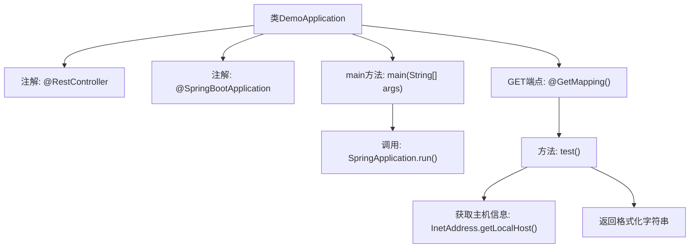

# 基础信息

|      |      |
|------|------|
| 名称 | DemoApplication |
| 编码语言 | .java |
| 代码路径 | demo/src/main/java/com/example/demo/DemoApplication.java |
| 包名 | com.example.demo |
| 依赖项 | ['org.springframework.boot.SpringApplication', 'org.springframework.boot.autoconfigure.SpringBootApplication', 'org.springframework.web.bind.annotation.GetMapping', 'org.springframework.web.bind.annotation.RestController', 'java.net.InetAddress', 'java.net.UnknownHostException'] |
| 概述说明 | SpringBoot应用，含主类和GET接口返回主机名。 |

# 说明

这是一个基于Spring Boot框架的简单Java应用程序示例。它定义了一个主类DemoApplication，使用@SpringBootApplication注解标记为Spring Boot应用入口。类中包含main方法启动应用，并通过@RestController注解表明这是一个REST控制器。控制器中定义了一个GET请求处理方法test()，该方法返回包含主机名的"Hello Word!"字符串。整个应用展示了Spring Boot的基本启动流程和简单的REST接口实现。

# 类列表 Class Summary

| 名称   | 类型  | 说明 |
|-------|------|-------------|
| DemoApplication | class | SpringBoot应用，含主类和GET接口返回主机名。 |


## 类 DemoApplication

|      |      |
|------|------|
| 访问范围 | @RestController;@SpringBootApplication;public |
| 类型 | class |
| 名称 | DemoApplication |
| 说明 | SpringBoot应用，含主类和GET接口返回主机名。 |


### UML类图

```mermaid
classDiagram
    class DemoApplication {
        <<RestController>>
        <<SpringBootApplication>>
        +main(String[] args) void
        +test() String
    }
    DemoApplication --> InetAddress : 依赖: 获取主机信息
    class InetAddress {
        <<java.net>>
        +getLocalHost() InetAddress
    }
```

这段代码定义了一个Spring Boot应用DemoApplication，它包含一个主方法用于启动应用，以及一个返回主机信息的测试接口。类图展示了DemoApplication作为RestController和SpringBootApplication的双重身份，通过依赖InetAddress类来获取本地主机信息。该控制器暴露了一个GET端点，返回包含主机名的问候字符串，体现了Spring Boot应用的典型结构和网络功能调用的基本模式。


### 内部方法调用关系图



这段代码是一个Spring Boot应用的入口类，包含主启动方法和一个REST接口。流程图展示了从类声明到方法调用的完整结构：首先通过@RestController和@SpringBootApplication注解声明控制器和启动类，main方法调用SpringApplication.run启动应用，@GetMapping定义了一个返回格式化字符串的端点，该端点通过InetAddress获取本地主机信息并返回"Hello Word!"响应。整个流程体现了Spring Boot应用的典型启动过程和HTTP请求处理链路。

### 字段列表 Field List

| 名称  | 类型  | 说明 |
|-------|-------|------|

### 方法列表 Method List

| 名称  | 类型  | 说明 |
|-------|-------|------|
| main | void | Java Spring应用启动主方法 |
| test | String | Spring接口返回主机名的"Hello World"。 |


